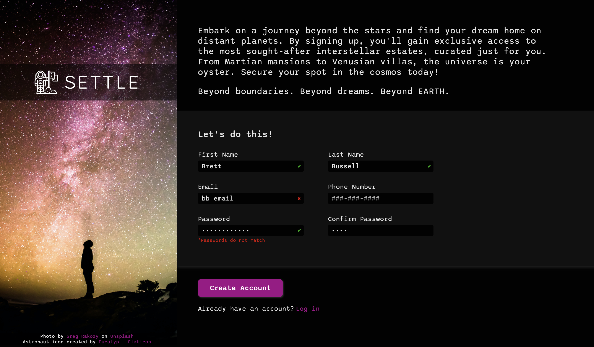
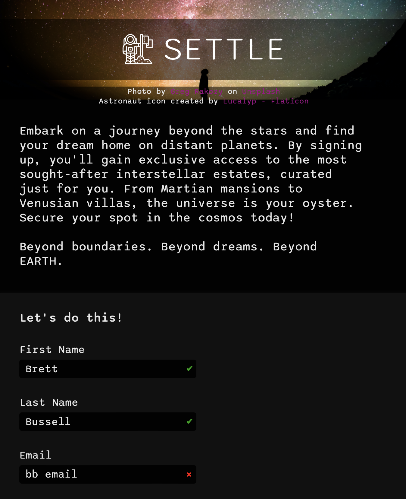

# Sign Up Form

A simple and responsive sign-up form with live form validation.

## Description

This project is a responsive sign-up form built with HTML, CSS, and JavaScript. It includes live form validation with a simple and intuitive user feedback.

## Screenshots

### Wide View



### Narrow View



## Preview

You can view a live preview of the page [here](https://sourdoughbredd.github.io/sign-up-form/).

## Table of Contents

- [Description](#description)
- [Screenshots](#screenshots)
- [Preview](#preview)
- [Features](#features)
- [Installation](#installation)
- [Usage](#usage)
- [Tech Stack](#tech-stack)
- [License](#license)
- [Contact Information](#contact-information)

## Features

- Responsive design via flexbox and media queries
- Live form validation with simple and effective user feedback

## Installation

1. Clone the repository:
   ```sh
   git clone https://github.com/sourdoughbredd/sign-up-form.git
   ```
2. Navigate to the project directory:
   ```sh
   cd sign-up-form
   ```
3. Open `index.html` in your preferred web browser.

## Usage

- Open `index.html` in a web browser to view the sign-up form.
- Fill in the form fields to see live validation in action.
- Resize the page to see responsiveness

## Tech Stack

- HTML
- CSS
- JavaScript

## License

This project is licensed under the MIT License.

## Contact Information

For any questions or suggestions, please contact Brett Bussell at [bwbussell24@gmail.com](mailto:bwbussell24@gmail.com).
